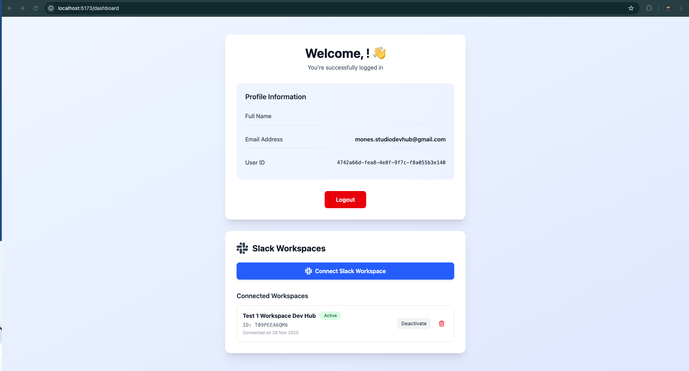

# Nest React SlackFlow Starter

Authentication boilerplate with NestJS (backend), React (frontend), and basic Slack integration for reading channel messages using a bot.


## Tech Stack
- **Frontend**: React + Vite + Tailwind CSS
- **Backend**: NestJS + TypeORM
- **Database**: PostgreSQL (Docker)

## Prerequisites
- Node.js (v18 or higher)
- Docker and Docker Compose
- npm or yarn

## Installation & Setup

### 1. Clone and Install
```bash
# Install backend dependencies
cd backend && npm install

# Install frontend dependencies
cd ../frontend && npm install
```

### 2. Environment Setup
Copy .env files and configure:

**Root .env** (for Docker):
```
POSTGRES_USER=postgres
POSTGRES_PASSWORD=postgres123
POSTGRES_DB=nest-react-boilerplate-db
POSTGRES_PORT=5432
```

**backend/.env** (for NestJS):
```
DB_HOST=localhost
DB_PORT=5432
DB_USERNAME=postgres
DB_PASSWORD=postgres123
DB_NAME=nest-react-boilerplate-db
JWT_SECRET=your-secret-key-change-in-production
JWT_EXPIRES_IN=24h
PORT=4000
FRONTEND_URL=http://localhost:5173
SWAGGER_ENABLED=true
SLACK_CLIENT_ID=your-slack-client-id
SLACK_CLIENT_SECRET=your-slack-client-secret
SLACK_SIGNING_SECRET=your-slack-signing-secret
SLACK_REDIRECT_URI=your-slack-redirect-uri
```

**frontend/.env** (for Vite):
```
VITE_API_URL=http://localhost:4000
```

### 3. Start Database
```bash
docker-compose up -d
```

### 4. Start Backend
```bash
cd backend
npm run start:dev
```

### 5. Start Frontend
```bash
cd frontend
npm run dev
```

### 6. Access Application
- **Frontend**: http://localhost:5173
- **Backend**: http://localhost:4000
- **Database**: localhost:5432

## Usage Flow
1. Register a new account at `/register`
2. Login with credentials at `/login`
3. View profile at `/dashboard`
4. Logout to return to login

## Development Notes
- Backend runs on port 4000
- Frontend runs on port 5173 (Vite default)
- PostgreSQL runs on port 5432
- JWT tokens expire in 24 hours
- Passwords are hashed with bcrypt (10 rounds)
- Swagger documentation available at /api/docs
- Use "Authorize" button in Swagger UI to test protected endpoints

## Project Structure
```
nest-react-boilerplate/
├── backend/
│   ├── src/
│   │   ├── auth/
│   │   │   ├── dto/
│   │   │   ├── guards/
│   │   │   ├── strategies/
│   │   │   ├── auth.controller.ts
│   │   │   ├── auth.service.ts
│   │   │   └── auth.module.ts
│   │   ├── users/
│   │   │   ├── entities/
│   │   │   ├── users.controller.ts
│   │   │   ├── users.service.ts
│   │   │   └── users.module.ts
│   │   ├── slack/
│   │   │   ├── dto/
│   │   │   ├── entities/
│   │   │   ├── slack.controller.ts
│   │   │   ├── slack.service.ts
│   │   │   └── slack.module.ts
│   │   ├── app.module.ts
│   │   └── main.ts
│   └── .env
├── frontend/
│   ├── src/
│   │   ├── components/
│   │   │   └── PrivateRoute.jsx
│   │   ├── context/
│   │   │   └── AuthContext.jsx
│   │   ├── pages/
│   │   │   ├── Login.jsx
│   │   │   ├── Register.jsx
│   │   │   └── Dashboard.jsx
│   │   ├── services/
│   │   │   └── api.js
│   │   ├── App.jsx
│   │   └── main.jsx
│   └── .env
├── docker-compose.yml
├── .env
└── README.md
```

## Frontend Features
- JWT token storage in localStorage
- Automatic token attachment to API requests
- Protected route handling
- Auth context for global state management
- Private route component for /dashboard protection
- Automatic redirects for unauthenticated users
- Loading states during authentication checks
- Slack workspace management (Connect, View, Toggle, Delete)


## Database Schema

### Users Table
| Column | Type | Constraints |
|--------|------|-------------|
| id | UUID | Primary Key |
| email | VARCHAR | Unique, Not Null |
| full_name | VARCHAR | Not Null |
| password | VARCHAR | Not Null (Hashed) |
| created_at | TIMESTAMP | Default: now() |
| updated_at | TIMESTAMP | Auto-update |

### Slack Installations Table
| Column | Type | Constraints |
|--------|------|-------------|
| id | UUID | Primary Key |
| user_id | UUID | Foreign Key (Users) |
| slack_team_id | VARCHAR | Not Null |
| slack_team_name | VARCHAR | Not Null |
| access_token | VARCHAR | Not Null |
| bot_token | VARCHAR | Not Null |
| is_active | BOOLEAN | Default: true |
| created_at | TIMESTAMP | Default: now() |
| updated_at | TIMESTAMP | Auto-update |

## API Documentation
- **Swagger UI**: http://localhost:4000/api/docs
- Interactive API testing with authentication support
- Automatic request/response examples
- JWT Bearer token authentication integrated
- See interactive documentation at /api/docs for detailed request/response schemas

## API Endpoints

### Authentication
| Method | Endpoint | Description | Protected |
|--------|----------|-------------|-----------|
| POST | /auth/register | Register new user | No |
| POST | /auth/login | Login user | No |
| GET | /auth/profile | Get current user | Yes |

### Slack Integration
| Method | Endpoint | Description | Protected |
|--------|----------|-------------|-----------|
| GET | /slack/install | Initiate Slack OAuth | No |
| GET | /slack/oauth_redirect | Handle Slack OAuth callback | No |
| POST | /slack/messages | Handle Slack events | No |
| GET | /slack/workspaces | List connected workspaces | Yes |
| PATCH | /slack/workspaces/:id | Toggle workspace status | Yes |
| DELETE | /slack/workspaces/:id | Delete workspace connection | Yes |
| POST | /slack/notify | Send message to channel | Yes |
| POST | /slack/notify-thread | Send reply to thread | Yes |

### Request/Response Examples

#### Register
```json
// POST /auth/register
{
  "email": "user@example.com",
  "fullName": "John Doe",
  "password": "password123"
}
```

#### Login
```json
// POST /auth/login
{
  "email": "user@example.com",
  "password": "password123"
}
```

#### Profile
```json
// GET /auth/profile
// Header: Authorization: Bearer <token>
{
  "id": "uuid",
  "email": "user@example.com"
}
```

#### Send Message to Channel
```json
// POST /slack/notify
// Header: Authorization: Bearer <token>
{
  "channelId": "C12345678",
  "message": "Hello from API!"
}
```

#### Send Reply to Thread
```json
// POST /slack/notify-thread
// Header: Authorization: Bearer <token>
{
  "channelId": "C12345678",
  "threadTs": "1706689205.513219",
  "message": "Replying to a thread via API!"
}
```
## Where to find the slack credentials
- go to https://api.slack.com/apps/ to find the app. lets say app id is `A0A07ESPHTQ`
- for `SLACK_CLIENT_ID` go to `https://api.slack.com/apps/A0A07ESPHTQ/general?`
- for `SLACK_CLIENT_SECRET` go to `https://api.slack.com/apps/A0A07ESPHTQ/general?`
- for `SLACK_SIGNING_SECRET` go to `https://api.slack.com/apps/A0A07ESPHTQ/general?`
- for `SLACK_REDIRECT_URI` go to `https://api.slack.com/apps/A0A07ESPHTQ/oauth?`


## What to set in the slack app

### Enable Manage distribution 
go to https://app.slack.com/app-settings/T09D6SP1JE9/A0A07ESPHTQ/distribute and enable it

### Enable Event Subscriptions
go to https://api.slack.com/apps/A0A07ESPHTQ/event-subscriptions? to enable it
and set request url for example `https://amani-pajamaed-singlehandedly.ngrok-free.app/slack/messages`

### Redirect URL
go to https://api.slack.com/apps/A0A07ESPHTQ/oauth? to set Redirect URLs for example `https://amani-pajamaed-singlehandedly.ngrok-free.app/slack/oauth_redirect`

### Set Scopes
go to https://api.slack.com/apps/A0A07ESPHTQ/oauth? to set Scopes 
- Bot Token Scopes
  - app_mentions:read
  - channels:history
  - channels:read
  - chat:write
  - groups:history
  - groups:read
  - im:history
  - im:read
- User Token Scopes
  - user:read
  - user:read.email

